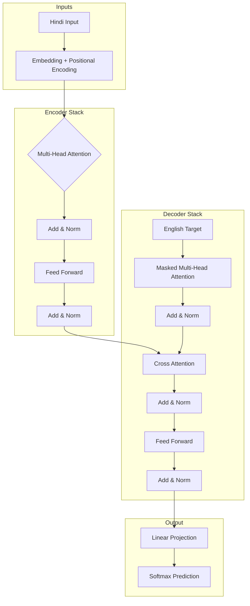

# **Machine Translation with Transformers**

[Project Overview](#overview) • [Architecture](#architecture) • [Key Features](#features) • [Installation](#installation) • [Results](#results)

---

## 🧐 Project Overview

This project implements a Sequence-to-Sequence (Seq2Seq) model for translating Hindi text to English using the Transformer architecture. Unlike traditional Recurrent Neural Networks (RNNs), this model leverages self-attention mechanisms to process input sequences in parallel, allowing for faster training and better handling of long-range dependencies. The system features a custom-built Encoder-Decoder structure with Multi-Head Attention layers designed from scratch in PyTorch. It utilizes the OpusBook dataset for bilingual training and includes a robust training pipeline with automated checkpointing and real-time loss visualization. The result is a highly efficient translation model capable of capturing complex grammatical structures.

---

## 🏗️ Architecture & Tools

### The Transformer Model
This project is built upon the groundbreaking architecture proposed in the seminal paper **"Attention Is All You Need"** (Vaswani et al., 2017). 

Traditional sequence models (like LSTMs) process data sequentially, which limits parallelization and struggles with long sentences. The Transformer replaces recurrence entirely with **Self-Attention mechanisms**. This allows the model to look at every word in the sentence simultaneously and understand the context of each word based on its relationship to every other word, regardless of their distance in the sentence.

Our implementation strictly follows the standard **Encoder-Decoder** design:
* **Encoder:** Processes the input Hindi sentence and creates a contextual understanding of it.
* **Decoder:** Uses that understanding to generate the corresponding English translation, word by word.

📄 **Original Paper:** [Read "Attention Is All You Need" on arXiv](https://arxiv.org/abs/1706.03762)

### 🛠️ Libraries Used
The project is implemented using the following core libraries:

* **PyTorch:** For building the neural network layers (Encoder, Decoder, Attention) and managing the training loop.
* **NumPy:** For efficient numerical operations and data handling.
* **Matplotlib:** For visualizing the loss convergence graphs during training.
* **Pickle:** For serializing and saving loss data for post-training analysis.
* **Sys:** For system-specific path configurations.
